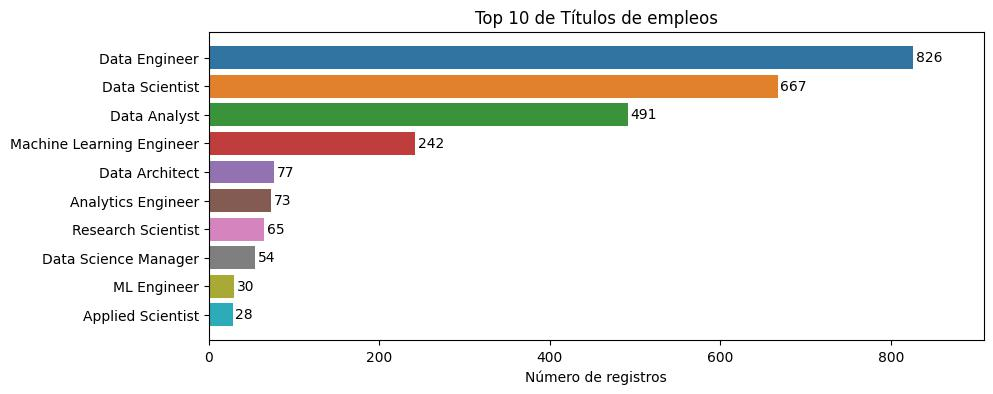
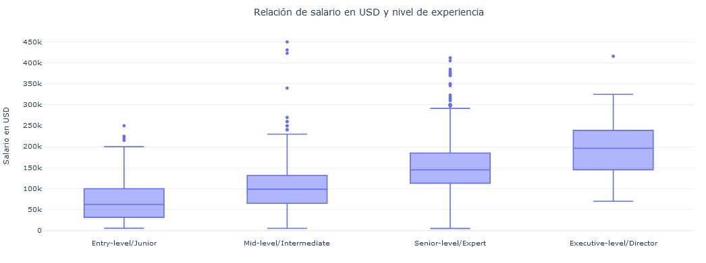

# <b>
Análisis exploratorio de datos de salarios de AI/ML 
</b>

En este desarrollo se realiza una exploración y visualización de datos salariales de profesionales en los campos de la Inteligencia Artificial (AI) y Aprendizaje Automático (ML). Desarrollo disponible en el siguiente [enlace](https://colab.research.google.com/github/mariameneses/eda-salarios-ai-ml/blob/notebooks/codes/eda_visualizacion_salarios_ai_ml.ipynb).

Los datos provienen de [ai-jobs.net](https://ai-jobs.net/). Ai-jobs recolecta información de salarios, de forma anónima, de profesionales en los campos de AI/ML y Big Data, y la pone a disposición del público para que cualquiera pueda usarla, compartirla y jugar con ella.

## Descripción

  <h3>Tabla de contenido del desarrollo</h3>
  <ol>
      <li>Importar librerías</li>
      <li>Carga de conjunto de datos</li>
      <li>Entendimiento del conjunto de datos</li>
      <li>Evaluación del conjunto de datos</li>
      <li>Exploración univariada</li>
          <ol>
              <li>Distribución de los salarios en USD</li>
              <li>Exploración de títulos de empleos</li>
              <li>Exploración de los niveles de experiencia</li>
              <li>Exploración de los tipos de contratación</li>
              <li>Exploración de los tamaños de las empresas</li>
              <li>Exploración de los años de pago del salario</li>
              <li>Exploración del tipo de trabajo</li>
              <li>Exploración de las ubicaciones de las empresas</li>
              <li>Exploración de las ubicaciones de residencia de los empleados</li>
          </ol>
      <li>Exploración bivariada</li>
          <ol>
              <li>Relaciones entre características categóricas limitadas</li>
              <li>Relaciones entre características categóricas limitadas y el salario</li>
              <li>Relaciones entre características categóricas y el salario en USD</li>
          </ol>
      <li>Conclusiones</li>
  </ol>

## Detalles de implementación

La implementación se realiza en la herramienta Google Colaboratory (Colab).

## Algunas gráficas obtenidas

### - Exploración univariada

 
<figure style="margin:0">
  <figcaption style="font-size:90%; text-align:center">Distribución de salarios en USD</figcaption>
  
</figure>

 
<figure style="margin:0">
  <figcaption style="font-size:90%; text-align:center">Top 10 de títulos de empleos o roles más frecuentes</figcaption>
  
</figure>

### - Exploración bivariada

 
<figure style="margin:0">
  <figcaption style="font-size:90%; text-align:center">Diagrama de cajas y bigotes de la relación entre salario en USD y año pagado</figcaption>
  
</figure>

 
<figure style="margin:0">
  <figcaption style="font-size:90%; text-align:center">Gráfica de salario promedio en USD y año pagado</figcaption>
  
</figure>

 
<figure style="margin:0">
  <figcaption style="font-size:90%; text-align:center">Diagrama de cajas y bigotes de la relación entre salario en USD y nivel de experiencia</figcaption>
  
</figure>

 
<figure style="margin:0">
  <figcaption style="font-size:90%; text-align:center">Gráfica de salario promedio en USD y nivel de experiencia</figcaption>
  
</figure>

 
<figure style="margin:0">
  <figcaption style="font-size:90%; text-align:center">Gráfica de salario promedio en USD para las 5 ubicaciones de empleado más frecuentes</figcaption>
  
</figure>

 
<figure style="margin:0">
  <figcaption style="font-size:90%; text-align:center">Mapa de salario por ubicación de empleado</figcaption>
  
</figure>

 
<figure style="margin:0">
  <figcaption style="font-size:90%; text-align:center">Mapa de salario por ubicación de empresa</figcaption>
  
</figure>

 
<figure style="margin:0">
  <figcaption style="font-size:90%; text-align:center">Gráfica de salario promedio en USD para los 10 títulos de empleos o roles más frecuentes</figcaption>
  
</figure>

## Conclusiones

A partir de la exploración de los datos, se evidencia que en promedio los salarios aumentan conforme avanzan los años y de igual manera a medida que el empleado obtiene más experiencia. Además, el salario se mantiene similar para los empleados que trabajen de forma completamente remota o completamente presencial.

También se observa gran variedad de roles en el área de Inteligencia Artificial (AI) y Aprendizaje Automático (ML) que en general presentan salarios promedios similares.

Sin embargo, se presenta una dependencia de los salarios y la ubicación del empleado o la empresa, exponiendo mayores valores para los países de Estados Unidos y Canadá.

Hay que tener en cuenta que la base de datos contiene en su mayoría datos de empleados ubicados en Estados Unidos o empleados de empresas ubicadas en este país y se tiene una escaza representación de otros países.